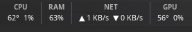

# Cinnamon Stack Stats

A compact, highly customizable Cinnamon desktop panel applet that monitors real-time system metrics (CPU, RAM, SWAP, Network Throughput, Root Disk, and GPU) in a two-tier stacked layout.



## Features

- **Modular Panels**: Toggle individual monitors independently (CPU Temp/Usage, RAM %, SWAP %, Network Up/Down, Disk `/`, GPU Temp/Usage).
- **Network Throughput**: Automatic auto-scaling bandwidth (`KB/s`, `MB/s`, `GB/s`) with separate toggles for Upload and Download.
- **Customization Suite**:
  - Full typography selection (font family, font size, bold headers).
  - Custom color pickers for labels and values.
  - Optional column dividing borders with custom color and padding controls.
- **Adjustable Polling**: Refresh rate configurable from 1 to 10 seconds.
- **Low Footprint**: Direct `/proc` and `/sys` virtual filesystem reads.
- **Click Action**: Click the applet to open GNOME System Monitor.

## Installation

### Method 1: Git Clone
```bash
git clone [https://github.com/]<your-username>/cinnamon-stack-stats.git ~/.local/share/cinnamon/applets/system-stats@shishir